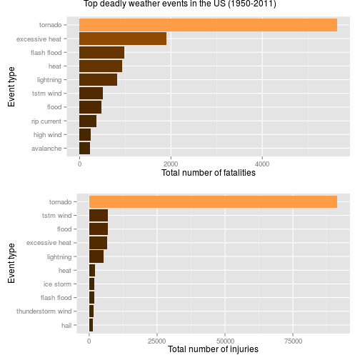
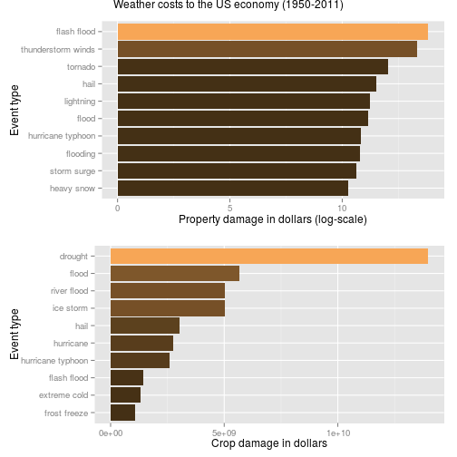

#Health and Economic Impact of Weather Events in the US
================


Storms and other severe weather events can cause both public health and economic
problems for communities and municipalities. Many severe events can result in
fatalities, injuries, and property damage, and preventing such outcomes to the extent
possible is a key concern.

This project involves exploring the U.S. National Oceanic and Atmospheric
Administration's (NOAA) storm database. This database tracks characteristics of major
storms and weather events in the United States, including when and where they occur, as
well as estimates of any fatalities, injuries, and property damage.

####Synopsis
===============
The analysis on the storm event database revealed that tornadoes are the most dangerous weather event to the populations health. The second most dangerous event type is excessive heat. The economic impact of weather events was also analyzed. Flash floods and thunderstorm winds caused billions of dollars in property damages between 1950 and 2011. The largest damage to crops were caused by droughts, followed by floods and hailing.

####Data Processing
===============

The analysis was performed on
[Storm Events Database](http://www.ncdc.noaa.gov/stormevents/ftp.jsp), provided by
[National Climatic Data Center](http://www.ncdc.noaa.gov/). The data is from a comma-separated-value file available
[here](https://d396qusza40orc.cloudfront.net/repdata%2Fdata%2FStormData.csv.bz2).
There is also some documentation of the data available
[here](https://d396qusza40orc.cloudfront.net/repdata%2Fpeer2_doc%2Fpd01016005curr.pdf).

The first step is to read the data into a data frame.

```r
storm <- read.csv(bzfile("data/repdata-data-StormData.csv.bz2"))
```

Before the analysis, the data need some preprocessing. Event types don't have a
specific format. For instance, there are events with types `Frost/Freeze`,
`FROST/FREEZE` and `FROST\\FREEZE` which refer to the same type of
event. So we will translate all letters to lowercase for uniformity.


```r
# number of unique event types
length(unique(storm$EVTYPE))
```

```
## [1] 985
```

```r
# translate all letters to lowercase
event_types <- tolower(storm$EVTYPE)
# replace all punct. characters with a space
event_types <- gsub("[[:blank:][:punct:]+]", " ", event_types)
length(unique(event_types))
```

```
## [1] 874
```

```r
# update the data frame
storm$EVTYPE <- event_types
```

No further data preprocessing was performed although the event type field can be
processed further to merge event types such as `tstm wind` and `thunderstorm wind`. 
After the cleaning, as expected, the number of unique event types reduce
significantly. For further analysis, the cleaned event types are used.


####Dangerous Events with respect to Population Health
================================================

To find the event types that are most harmful to population health, the number
of casualties are aggregated by the event type.


```r
library(plyr)
casualties <- ddply(storm, .(EVTYPE), summarize,
                    fatalities = sum(FATALITIES),
                    injuries = sum(INJURIES))

# Find events that caused most death and injury
fatal_events <- head(casualties[order(casualties$fatalities, decreasing = T), ], 10)
injury_events <- head(casualties[order(casualties$injuries, decreasing = T), ], 10)
```

######Top 10 events that caused largest number of deaths are


```r
fatal_events[, c("EVTYPE", "fatalities")]
```

```
            EVTYPE fatalities
741        tornado       5633
116 excessive heat       1903
138    flash flood        978
240           heat        937
410      lightning        816
762      tstm wind        504
154          flood        470
515    rip current        368
314      high wind        248
19       avalanche        224
```

######Top 10 events that caused most number of injuries are


```r
injury_events[, c("EVTYPE", "injuries")]
```

```
               EVTYPE injuries
741           tornado    91346
762         tstm wind     6957
154             flood     6789
116    excessive heat     6525
410         lightning     5230
240              heat     2100
382         ice storm     1975
138       flash flood     1777
671 thunderstorm wind     1488
209              hail     1361
```

####Economic Effects of Weather Events
==================================

To analyze the impact of weather events on the economy, available property
damage and crop damage reportings/estimates were used.

In the raw data, the property damage is represented with two fields, a number
`PROPDMG` in dollars and the exponent `PROPDMGEXP`. Similarly, the crop damage
is represented using two fields, `CROPDMG` and `CROPDMGEXP`. The first step in the
analysis is to calculate the property and crop damage for each event.


```r
exp_transform <- function(e) {
    # h -> hundred, k -> thousand, m -> million, b -> billion
    if (e %in% c('h', 'H'))
        return(2)
    else if (e %in% c('k', 'K'))
        return(3)
    else if (e %in% c('m', 'M'))
        return(6)
    else if (e %in% c('b', 'B'))
        return(9)
    else if (!is.na(as.numeric(e))) # if a digit
        return(as.numeric(e))
    else if (e %in% c('', '-', '?', '+'))
        return(0)
    else {
        stop("Invalid exponent value.")
    }
}
```

```r
prop_dmg_exp <- sapply(storm$PROPDMGEXP, FUN=exp_transform)
storm$prop_dmg <- storm$PROPDMG * (10 ** prop_dmg_exp)
crop_dmg_exp <- sapply(storm$CROPDMGEXP, FUN=exp_transform)
storm$crop_dmg <- storm$CROPDMG * (10 ** crop_dmg_exp)
```

```r
# Compute the economic loss by event type
library(plyr)
econ_loss <- ddply(storm, .(EVTYPE), summarize,
                   prop_dmg = sum(prop_dmg),
                   crop_dmg = sum(crop_dmg))

# filter out events that caused no economic loss
econ_loss <- econ_loss[(econ_loss$prop_dmg > 0 | econ_loss$crop_dmg > 0), ]
prop_dmg_events <- head(econ_loss[order(econ_loss$prop_dmg, decreasing = T), ], 10)
crop_dmg_events <- head(econ_loss[order(econ_loss$crop_dmg, decreasing = T), ], 10)
```

Top 10 events that caused most property damage (in dollars) are as follows


```r
prop_dmg_events[, c("EVTYPE", "prop_dmg")]
```

```
                EVTYPE     prop_dmg
138        flash flood 6.820237e+13
697 thunderstorm winds 2.086532e+13
741            tornado 1.078951e+12
209               hail 3.157558e+11
410          lightning 1.729433e+11
154              flood 1.446577e+11
366  hurricane typhoon 6.930584e+10
166           flooding 5.920826e+10
585        storm surge 4.332354e+10
270         heavy snow 1.793259e+10
```

Similarly, the events that caused biggest crop damage are


```r
crop_dmg_events[, c("EVTYPE", "crop_dmg")]
```

```
               EVTYPE    crop_dmg
84            drought 13972566000
154             flood  5661968450
519       river flood  5029459000
382         ice storm  5022113500
209              hail  3025974480
357         hurricane  2741910000
366 hurricane typhoon  2607872800
138       flash flood  1421317100
125      extreme cold  1312973000
185      frost freeze  1094186000
```

##Results
=======

####Health impact of weather events
-------------------------------

The following plot shows top dangerous weather event types.


```r
library(ggplot2)
library(gridExtra)
# Set the levels in order
p1 <- ggplot(data=fatal_events,
             aes(x=reorder(EVTYPE, fatalities), y=fatalities, fill=fatalities)) +
    geom_bar(stat="identity") +
    coord_flip() +
    ylab("Total number of fatalities") +
    xlab("Event type") +
    theme(legend.position="none")

p2 <- ggplot(data=injury_events,
             aes(x=reorder(EVTYPE, injuries), y=injuries, fill=injuries)) +
    geom_bar(stat="identity") +
    coord_flip() + 
    ylab("Total number of injuries") +
    xlab("Event type") +
    theme(legend.position="none")

grid.arrange(p1, p2, main="Top deadly weather events in the US (1950-2011)")
```

 

Tornadoes cause most number of deaths and injuries among all event types. There 
are more than 5,000 deaths and more than 10,000 injuries in the last 60 years
in US, due to tornadoes. 
The other event types that are most dangerous with respect to population health
are excessive heat and flash floods.

####Economic impact of weather events
---------------------------------

The following plot shows the most severe weather event types with respect to
economic cost that they have costed since 1950s.


```r
library(ggplot2)
library(gridExtra)
# Set the levels in order
p1 <- ggplot(data=prop_dmg_events,
             aes(x=reorder(EVTYPE, prop_dmg), y=log10(prop_dmg), fill=prop_dmg )) +
    geom_bar(stat="identity") +
    coord_flip() +
    xlab("Event type") +
    ylab("Property damage in dollars (log-scale)") +
    theme(legend.position="none")

p2 <- ggplot(data=crop_dmg_events,
             aes(x=reorder(EVTYPE, crop_dmg), y=crop_dmg, fill=crop_dmg)) +
    geom_bar(stat="identity") +
    coord_flip() + 
    xlab("Event type") +
    ylab("Crop damage in dollars") + 
    theme(legend.position="none")

grid.arrange(p1, p2, main="Weather costs to the US economy (1950-2011)")
```

 

Property damages are given in logarithmic scale due to large range of values.
The data shows that flash floods and thunderstorm winds cost the largest
property damages among weather-related natural diseasters.

The most severe weather event in terms of crop damage are droughts. In the last
half century, droughts have caused more than 10 billion dollars damage. Other
severe crop-damage-causing event types are floods and hailing.
